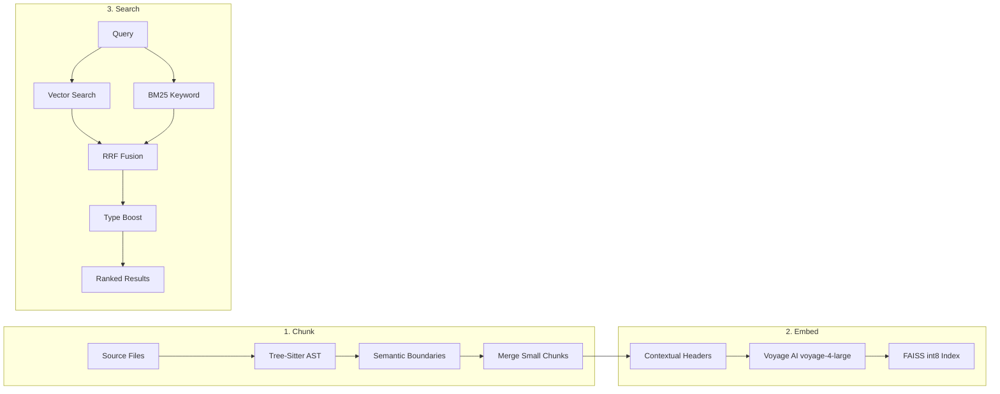

# code-search

Semantic code search MCP server for Claude Code. Ask natural language questions about your codebase and get ranked, relevant results instead of string matches.

## Why This Exists

Standard code search (grep, ripgrep, Glob) finds text patterns. Ask "where is the firewall configuration?" and you get every file containing the word "firewall" — hundreds of results across comments, variable names, tests, and documentation. The actual firewall config function is buried at position #47.

Semantic search understands *meaning*. The same query returns the actual firewall config function at position #1 because the embedding model understands that `networking.firewall.allowedTCPPorts` is semantically related to "firewall configuration" even though the words don't match exactly.

This matters for AI coding assistants. Every irrelevant result consumes context window tokens. A grep for "authentication" in a large monorepo returns thousands of lines. Semantic search returns the 10 most relevant functions, saving ~80K tokens per query. Over a multi-tool session, that's the difference between hitting compaction at 60% context and finishing the task with room to spare.

## How It Works

The search pipeline has three stages: **chunk**, **embed**, and **search**.




### 1. Chunking (Tree-Sitter AST)

Source files are parsed into Abstract Syntax Trees using tree-sitter, then split at semantic boundaries — function definitions, class declarations, module sections. This means a search result is always a complete logical unit (a full function, a full class), never a random 500-character window that starts mid-expression.

**18 languages supported**: Python, JavaScript, TypeScript, JSX, TSX, Go, Rust, Java, C, C++, C#, Svelte, plus regex-based chunking for Markdown, TOML, YAML, HCL, Nix, and configuration files.

**Chunk merging** (inspired by the cAST paper, CMU 2025): After AST splitting, a post-processing pass greedily merges adjacent small chunks up to a 1,500 non-whitespace character budget. This captures gap code — imports, constants, and comments that fall between semantic units — and prevents sub-100-token chunks that degrade embedding quality by 6-16% (Ekimetrics 2026 benchmark). The merge uses non-whitespace character count rather than line count because a 50-line file of blank lines and a 50-line file of dense code are not equivalent.

**Contextual headers**: Before embedding, each chunk gets a header prepended: `# From <filepath> - <type> <name>`. This gives the embedding model critical context about what the chunk *is* (a function named `authenticate` in `auth/handlers.py`), improving retrieval accuracy by connecting the code content to its structural role. Adds +9.6% MRR on Nix files when combined with enriched sibling context.

### 2. Embedding (Voyage AI)

Each chunk is converted to a high-dimensional vector using [Voyage AI](https://voyageai.com)'s `voyage-4-large` model (MoE architecture, SOTA retrieval quality). The vectors are stored in a FAISS index with int8 quantization (4x smaller than float32, negligible quality loss on normalized vectors).

Four embedding providers are available:

| Provider | Model | Quality (MRR) | Data leaves machine? | Cost | Setup |
|----------|-------|:---:|:---:|:---:|---|
| **`voyage`** (default) | voyage-4-large | **0.828** | Yes (API call) | ~$0.06/1M tokens | Set `VOYAGE_API_KEY` |
| `voyage-code-3` | voyage-code-3 | 0.623–0.748¹ | Yes (API call) | ~$0.06/1M tokens | Set `VOYAGE_API_KEY`; use `EMBEDDING_PROVIDER=voyage-code-3` |
| `jina` | jina-code-0.5b | 0.638-0.742 | **No** (runs locally) | **Free** | Nothing — downloads model on first run |
| `local` | all-MiniLM-L6-v2 | ~0.35-0.45 | No | Free | Nothing |

¹ `voyage-code-3` aggregate A/B vs voyage-4-large: CI includes zero (PSM-full, n=102 golden + 183 harvested, rerank=off, 2026-05-15). Per-subproject: wins on TypeScript/mithrandir (+0.119 MRR, CI excludes zero), regresses on Nix (-0.091 MRR, CI excludes zero). Use for TypeScript-heavy corpora. See `docs/findings/2026-05-15-voyage-code-3-ab-finding.md`.

MRR (Mean Reciprocal Rank) is measured on 102 golden queries across 4 language sub-projects from a production Rust/Nix/TypeScript monorepo. A score of 0.828 means the correct answer is almost always the #1 result.

> **Note (2026-05-14 multitarget baseline)**: The 0.828 figure above is the Voyage-only MRR measured 2026-04-26 on the original 102-query golden set. The current production stack adds a Sonnet 4.6 reranker (see "Reranking" below) and the most recent PSM multitarget eval reports golden MRR=0.670 / HR@1=0.569 and harvested real-session MRR=0.814 / HR@1=0.770 on a broader, harder query mix. See [benchmarks/eval_v4/run_psm-full-voyage-multitarget/summary.json](benchmarks/eval_v4/run_psm-full-voyage-multitarget/summary.json) and `CLAUDE.md` for the defended current numbers.

**Why Voyage over local models?** The quality gap is enormous. Local sentence-transformers (all-MiniLM-L6-v2) score 0.35-0.45 MRR — the right answer is typically at position #3-5. Voyage-4-large scores 0.828 — position #1 almost every time. For an AI assistant consuming results in a token-limited context window, the difference between "right answer at #1" and "right answer at #4" means 3-4x fewer wasted tokens per query.

**Reranking.** The current default is **Sonnet 4.6 pointwise reranking** with the R9 Nix-aware clause (`RERANKER=sonnet`, validated +0.087 MRR / +0.137 HR@1 on n=183 multi-target real_session, see `CLAUDE.md`). Reranks top-15 hybrid candidates via Anthropic API with always-on graceful fallback to hybrid order. PR #199 briefly flipped the default to listwise on 2026-05-23 citing Phase C v2 bootstrap CI, but the rule-9 re-eval on current main (post-R9 pointwise) showed listwise harvested MRR delta −0.0456 CI [−0.0891, −0.0024] excludes zero unfavorable — the default was reverted the same day. Listwise (`RERANKER=listwise`) remains selectable for callers wanting the single-call latency profile. See `docs/findings/2026-05-23-listwise-default-eval-finding.md` for the eval narrative. The earlier "cross-encoder rerank (rerank-2.5) degrades quality by -30% MRR" finding still holds and is preserved as the off-by-default `RERANKER=cross-encoder` legacy path; `RERANKER=off` skips reranking entirely.

### 3. Search (Hybrid BM25 + Vector with RRF Fusion)

Queries run through two parallel search paths:

1. **Vector search**: The query is embedded via Voyage, then FAISS finds the most similar chunk vectors by cosine similarity. This handles semantic matches — "authentication logic" finds `validate_jwt_token()`.

2. **BM25 keyword search**: SQLite FTS5 full-text search finds exact keyword matches. This handles cases where you know the exact name — `validate_jwt_token` — and want direct string matching.

3. **Reciprocal Rank Fusion (RRF)**: Both result lists are fused using weighted RRF (50/50 for code, 70/30 vector-heavy for docs). RRF combines the *rankings* from both systems rather than raw scores, which is robust to score scale differences between vector similarity and BM25 TF-IDF.

4. **Chunk type boosting**: After fusion, results are boosted by type — functions and methods get 1.3x in code mode, sections and documents get 1.3x in docs mode. This ensures that searching for "authentication" surfaces the `authenticate()` function over the `# Authentication` markdown section when searching code.

5. **Query expansion**: Domain-specific synonym maps expand query terms before BM25 search. "auth" expands to include "authentication", "oauth", "jwt", "token", "credential", "login". This bridges the vocabulary gap between how developers *ask* about code and how code *names* things.

### Incremental Indexing (Merkle Trees)

After initial indexing, only changed files are re-embedded. A Merkle DAG (directed acyclic graph) tracks content hashes for every file and directory. On re-index, the tree is diffed against the stored snapshot — only files whose hashes changed get re-chunked and re-embedded. For a 3,000-chunk repo where 5 files changed, this means re-embedding ~20 chunks instead of 3,000, completing in seconds instead of minutes.

## Benchmarks

Quality was measured using golden test sets — hand-verified query-to-expected-file mappings across 4 language sub-projects from a production monorepo:

| Provider | Model | Nix (n=44) | Rust svc (n=20) | Rust lib (n=18) | TypeScript (n=20) | Weighted Avg |
|----------|-------|:---:|:---:|:---:|:---:|:---:|
| **`voyage`** (default) | **voyage-4-large** | **0.826** | **0.917** | 0.861 | 0.683 | **0.828** |
| `voyage-code-3` | voyage-code-3 | 0.517 (↓) | — | — | **0.596** (↑) | 0.623¹ |
| `voyage-context` | voyage-context-3 | 0.792 | 0.783 | **0.861** | 0.662 | 0.775 |
| `voyage` | voyage-4 | 0.803 | 0.892 | 0.861 | 0.650 | 0.806 |
| **`jina`** (local) | jina-code-0.5b | 0.638 | 0.742 | ~0.86 | 0.660 | ~0.72 |
| `local` | all-MiniLM-L6-v2 | ~0.35 | ~0.45 | ~0.50 | ~0.40 | ~0.42 |

¹ voyage-code-3 evaluated on PSM-full (4 subprojects, n=102 golden, rerank=off, 2026-05-15). Aggregate CI includes zero; Nix regression CI excludes zero (-0.091); TypeScript improvement CI excludes zero (+0.119). Aggregate column shows golden MRR. Rust rows omitted (not measured in this A/B). See `docs/findings/2026-05-15-voyage-code-3-ab-finding.md`.

### What the numbers mean

- **0.828 MRR**: The correct file is typically the #1 result. A developer (or AI agent) reading just the top result gets the right answer 83% of the time.
- **0.42 MRR**: The correct file is typically at position #3-5. The agent must read 3-5 results to find the right one, consuming 3-5x more context tokens.
- **The Nix gap**: Nix has unusual syntax (`mkOption`, `mkEnableOption`, `imports = [...]`) that generic models struggle with. Contextual headers and domain synonym expansion were specifically added to close this gap — Nix MRR improved from 0.72 to 0.826 with these features.

### Indexing performance

| Provider | Time (3,000 chunks) | Notes |
|----------|------|-------|
| `voyage` (voyage-4-large) | ~5-10 min | API rate-limited, batched |
| `jina` (local CPU) | ~50 min | First run downloads ~1GB model. GPU: ~5 min |
| `local` | ~2-5 min | Small model, fast but low quality |

## What It's Good For

- **Codebase exploration**: "Where is the authentication middleware?" returns ranked results by relevance, not alphabetical file listing
- **Cross-language search**: Same query works across Python, Rust, TypeScript, Nix — the embedding model understands all of them
- **API documentation search**: Index API docs as markdown and search them semantically (see below)
- **Large monorepos**: Handles 3,000+ chunk repos with incremental re-indexing. FAISS int8 quantization keeps indexes small.
- **Multi-project workflows**: Switch between indexed projects instantly. A developer working across 5 repos can search any of them without re-indexing.

## What It's Not Good For

- **Exact string matching**: If you know the exact function name `validate_jwt_token_v2`, use grep. Semantic search adds latency for literal lookups (though BM25 hybrid mode handles this reasonably well).
- **Structural queries**: "What functions call `authenticate()`?" is a graph question, not a search question. Use [code-graph](https://github.com/redacted-org/code-graph) for call chain analysis, dead code detection, and dependency tracing.
- **Real-time editing feedback**: The index updates on re-index, not on every keystroke. For IDE-style "as you type" search, use your editor's built-in search.
- **Binary files, images, PDFs**: Only text-based source files are indexed.

## The API Documentation Pipeline

A key lesson learned: pointing an AI assistant at raw API documentation is hit or miss. Usable OpenAPI specs are rarer than expected — most are incomplete, outdated, or missing critical details like auth flows, error shapes, and permission scopes.

The solution: **crawl API docs with [Firecrawl](https://firecrawl.dev), convert to structured markdown, and index with code-search**. This creates a searchable, semantic API reference that the AI assistant can query during development — resulting in significantly better MCP server implementations.

Currently indexed APIs:

| API | Files | Key content |
|-----|------:|-------------|
| Microsoft Graph (GCC High) | 21 | 602+ endpoints across identity, devices, audit, compliance |
| Slack | 176 | Web API, Events, Audit Logs, SCIM, Discovery, Legal Holds, Admin, GovSlack |
| X.AI | 85 | Inference, Tools, Files, Collections, Management, REST Reference |
| Claude Agent SDK | 31 | Agent loop, hooks, MCP, subagents, plugins, permissions |
| FastMCP | 60 | Server, client, auth, deployment, transforms, apps |

All API docs are indexed under a single `api-docs` project, so a single search query can surface results across all indexed APIs. File paths include the API name (e.g., `microsoft-graph/audit-sign-in-logs.md`) so results are attributable.

## Examples

### Semantic search vs grep

**grep** for "authentication" in the mcp-servers repo:
```
$ rg "authentication" --count
shared/mcp_http.py:3
msgraph/msgraph_mcp.py:8
crowdstrike/crowdstrike_mcp.py:2
tenable/tenable_mcp.py:1
lever/lever_mcp.py:1
docs/plans/auth-redesign.md:12
...47 files, 200+ matches across comments, strings, variable names, docs
```

**code-search** for "authentication middleware token validation":
```json
{
  "query": "authentication middleware token validation",
  "results": [
    {
      "file": "shared/mcp_http.py",
      "name": "_build_oauth",
      "type": "function",
      "lines": "45-72",
      "score": 0.91,
      "snippet": "async def _build_oauth(app, token_url, client_id, ...):\n    \"\"\"Build OAuth middleware for token validation...\""
    },
    {
      "file": "msgraph/msgraph_mcp.py",
      "name": "_auth_headers",
      "type": "function",
      "lines": "23-31",
      "score": 0.87,
      "snippet": "def _auth_headers():\n    \"\"\"Get auth headers from OBO token exchange...\""
    }
  ]
}
```

The grep returns 200+ matches across 47 files — comments, string literals, documentation, and actual code all mixed together. code-search returns the 2 functions that actually implement authentication, ranked by relevance.

### API documentation search

After indexing Microsoft Graph docs with `/api-ingest`:
```
Query: "conditional access policy permissions required scopes"
Project: api-docs/microsoft-graph

Result #1: conditional-access-identity.md (score: 0.89)
  "Required permissions: Policy.Read.All, Policy.ReadWrite.ConditionalAccess"

Result #2: constraints.md (score: 0.84)
  "Conditional Access: requires Policy.ReadWrite.ConditionalAccess for mutations"
```

This is the pipeline in action — Firecrawl crawled the Microsoft Graph docs, converted them to markdown, and code-search indexed them. Now Claude can look up the exact permissions needed before writing integration code, instead of guessing from training data.

## Examples

### Semantic search vs grep

**grep** for "authentication" in the mcp-servers repo:
```
$ rg "authentication" --count
shared/mcp_http.py:3
msgraph/msgraph_mcp.py:8
crowdstrike/crowdstrike_mcp.py:2
tenable/tenable_mcp.py:1
lever/lever_mcp.py:1
docs/plans/auth-redesign.md:12
...47 files, 200+ matches across comments, strings, variable names, docs
```

**code-search** for "authentication middleware token validation":
```json
{
  "query": "authentication middleware token validation",
  "results": [
    {
      "file": "shared/mcp_http.py",
      "name": "_build_oauth",
      "type": "function",
      "lines": "45-72",
      "score": 0.91,
      "snippet": "async def _build_oauth(app, token_url, client_id, ...):\n    \"\"\"Build OAuth middleware for token validation...\""
    },
    {
      "file": "msgraph/msgraph_mcp.py",
      "name": "_auth_headers",
      "type": "function",
      "lines": "23-31",
      "score": 0.87,
      "snippet": "def _auth_headers():\n    \"\"\"Get auth headers from OBO token exchange...\""
    }
  ]
}
```

The grep returns 200+ matches across 47 files — comments, string literals, documentation, and actual code all mixed together. code-search returns the 2 functions that actually implement authentication, ranked by relevance.

### API documentation search

After indexing Microsoft Graph docs with `/api-ingest`:
```
Query: "conditional access policy permissions required scopes"
Project: api-docs/microsoft-graph

Result #1: conditional-access-identity.md (score: 0.89)
  "Required permissions: Policy.Read.All, Policy.ReadWrite.ConditionalAccess"

Result #2: constraints.md (score: 0.84)
  "Conditional Access: requires Policy.ReadWrite.ConditionalAccess for mutations"
```

This is the pipeline in action — Firecrawl crawled the Microsoft Graph docs, converted them to markdown, and code-search indexed them. Now Claude can look up the exact permissions needed before writing integration code, instead of guessing from training data.

## Installation

### 1. Clone and install dependencies

```bash
git clone https://github.com/redacted-org/code-search.git
cd code-search
python -m venv .venv

# Linux/Mac
.venv/bin/pip install -r requirements.txt

# Windows
.venv\Scripts\pip install -r requirements.txt
```

### 2. Configure Claude Code

Add to your MCP settings (`.claude/settings.local.json` or project `.mcp.json`):

```json
{
  "mcpServers": {
    "code-search": {
      "type": "stdio",
      "command": "/path/to/code-search/.venv/bin/python",
      "args": ["-m", "mcp_server.server"],
      "cwd": "/path/to/code-search",
      "env": {
        "VOYAGE_API_KEY": "pa-..."
      }
    }
  }
}
```

For local-only (no API key, lower quality):
```json
{
  "env": {
    "EMBEDDING_PROVIDER": "jina"
  }
}
```

On Windows, use `.venv\Scripts\pythonw.exe` instead of `.venv/bin/python`.

### 3. Index a repo

```
mcp__code-search__index_directory(directory_path="/path/to/your/repo")
```

### 4. Search

```
mcp__code-search__search_code(query="authentication middleware")
```

## MCP Tools

| Tool | Purpose |
|------|---------|
| `search_code` | Semantic + keyword hybrid search across the active project |
| `find_similar_code` | Find chunks structurally similar to a given search result |
| `index_directory` | Index a directory in the background (with progress polling) |
| `get_indexing_progress` | Poll the status of a background indexing job |
| `clear_index` | Delete the active project's index entirely |
| `switch_project` | Change which indexed project is active for search |
| `list_projects` | Show all indexed projects with metadata |
| `get_index_status` | Index statistics — chunk count, embedding model, staleness |

## Environment Variables

| Variable | Default | Purpose |
|----------|---------|---------|
| `EMBEDDING_PROVIDER` | `voyage` (if `VOYAGE_API_KEY` set), else `local` | Embedding provider selection |
| `VOYAGE_API_KEY` | - | Voyage AI API key ([get one](https://dash.voyageai.com)) |
| `LOCAL_EMBEDDING_MODEL` | `jinaai/jina-code-embeddings-0.5b` | Model for `jina` provider |
| `JINA_TRUNCATE_DIM` | - | Matryoshka dimension truncation for Jina (0.5b: 64-896) |
| `CONTENT_MODE` | `code` | `code` (boost functions/methods) or `docs` (boost sections/documents) |
| `CONTEXTUAL_HEADERS` | `on` | Prepend structural context headers before embedding |
| `ENRICHED_CONTEXT` | `on` (jina/local), `off` (voyage-context) | Include sibling chunk names in headers (+9.6% MRR on Nix) |
| `QUERY_EXPANSION` | `on` | Expand queries with domain-specific synonyms before BM25 |
| `QUANTIZATION` | `int8` | FAISS index type: `int8` (4x smaller), `float32`, `binary` (32x smaller) |
| `VOYAGE_BATCH_API` | `off` | Use Voyage Batch API for full reindexes (33% cheaper, 1000+ chunks) |
| `CODE_SEARCH_STORAGE` | `~/.claude_code_search` | Storage directory for all indexes |

## Architecture

```
code-search/
├── chunking/                       # Multi-language AST chunking (18 file types)
│   ├── tree_sitter.py              # Tree-sitter grammar loading and AST parsing
│   ├── chunk_merging.py            # cAST-style post-processing merge (400-1500 NWS budget)
│   ├── multi_language_chunker.py   # Language detection and chunker dispatch
│   └── languages/                  # Per-language chunkers (Python, Rust, Go, TS, etc.)
├── embeddings/
│   ├── embedder.py                 # Provider routing, contextual header prepending
│   ├── openai_embedder.py          # Voyage AI + OpenAI standard /embeddings API
│   ├── voyage_context_embedder.py  # Voyage contextualized embeddings (legacy)
│   ├── voyage_batch_embedder.py    # Voyage Batch API for bulk indexing (33% cheaper)
│   ├── jina_code_embedder.py       # Jina local code embeddings (on-device)
│   └── sentence_transformer.py     # Local sentence-transformers fallback
├── search/
│   ├── indexer.py                  # FAISS vector index + SQLite FTS5 metadata store
│   ├── searcher.py                 # Hybrid BM25+vector search with RRF fusion
│   ├── query_rewriter.py           # Domain synonym expansion
│   └── incremental_indexer.py      # Merkle-tree-based change detection
├── merkle/
│   ├── merkle_dag.py               # Content-hash Merkle DAG for file change tracking
│   ├── change_detector.py          # Diff between Merkle snapshots
│   └── snapshot_manager.py         # Snapshot persistence and lifecycle
├── mcp_server/
│   ├── server.py                   # MCP stdio entry point
│   └── code_search_server.py       # Business logic, per-project config, tool handlers
├── benchmarks/
│   ├── golden_nix.json             # 44 hand-verified Nix queries
│   ├── golden_rust_assetman.json   # 20 Rust service queries
│   ├── golden_rust_libnet.json     # 18 Rust library queries
│   ├── golden_typescript_mithrandir.json  # 20 TypeScript queries
│   └── run_multilang_eval.py       # Cross-language A/B evaluation harness
└── tests/
    ├── unit/                       # 34+ unit tests
    └── integration/                # Full-flow, incremental indexing, MCP tool tests
```

## Testing

```bash
# All unit tests
.venv/Scripts/python.exe -m pytest tests/unit/ -v

# Multi-language benchmark evaluation (requires indexed repos)
.venv/Scripts/python.exe benchmarks/run_multilang_eval.py --lang rust-assetman

# Full eval across all 4 languages (~2 hours with Jina CPU)
.venv/Scripts/python.exe benchmarks/run_multilang_eval.py
```

The evaluation harness runs each golden query, checks whether the expected file appears in the top-K results, and computes MRR per language. Results are saved as timestamped JSON for A/B comparison between configurations.

## Troubleshooting

| Problem | Cause | Fix |
|---------|-------|-----|
| **Results are irrelevant** | Wrong embedding provider or stale index | Check `get_index_status` — if provider is `local`, switch to `voyage`. If index is >7 days old, re-run `index_directory`. |
| **Empty results** | Wrong project active, or index doesn't exist | Run `list_projects` to see what's indexed. Run `switch_project` to the correct path. |
| **"Indexing in progress"** | Auto-reindex triggered by stale detection | Wait 5-10 min for Voyage, or set `auto_reindex: false` to search the existing (possibly stale) index. |
| **Slow indexing** | Using Jina on CPU | First run downloads ~1GB model. Subsequent runs: ~50 min for 3K chunks on CPU. Switch to `voyage` provider for 5-10 min indexing via API. |
| **Wrong language detected** | File extension not in the 18 supported types | Check `chunking/available_languages.py`. Unsupported extensions fall back to generic line-based chunking. |
| **Nix results are poor** | Missing domain synonyms | Ensure `QUERY_EXPANSION=on` and `CONTEXTUAL_HEADERS=on`. These features were specifically tuned for Nix syntax. |
| **int8 index returns 0.0 similarity** | Index built with QT_8bit_direct (pre-2026-04-05 bug) | Delete the index (`clear_index`) and re-run `index_directory`. QT_8bit (trained) replaced QT_8bit_direct. |

## Comparison to Alternatives

| Tool | Strengths | Limitations | When to use instead of code-search |
|------|-----------|-------------|-----------------------------------|
| **grep / ripgrep** | Instant, exact, no indexing needed, regex support | No understanding of meaning — "auth" won't find "credential validation" | You know the exact string. Literal lookups. |
| **GitHub Code Search** | Searches all of GitHub, regex, symbol-aware | Cloud-only, no private GHES support, no custom embeddings | Searching across public repos you don't have locally. |
| **Sourcegraph** | Enterprise-grade, cross-repo, code intelligence | Requires deployment infrastructure, no local-first option | Large org with 100+ repos needing unified search. |
| **IDE search (VS Code, JetBrains)** | Real-time, integrated in editor, symbol navigation | Single-repo, no semantic understanding, no cross-project | Navigating within a single file or project you have open. |
| **code-graph** | Structural queries — call graphs, dead code, blast radius | No semantic/meaning-based search | "What calls this?" not "Where is the auth code?" |

**code-search is best when**: You need to find code by meaning across a codebase, especially when you don't know the exact names. It's designed for AI assistants that need to quickly locate relevant code with minimal token waste.

## Troubleshooting

| Problem | Cause | Fix |
|---------|-------|-----|
| **Results are irrelevant** | Wrong embedding provider or stale index | Check `get_index_status` — if provider is `local`, switch to `voyage`. If index is >7 days old, re-run `index_directory`. |
| **Empty results** | Wrong project active, or index doesn't exist | Run `list_projects` to see what's indexed. Run `switch_project` to the correct path. |
| **"Indexing in progress"** | Auto-reindex triggered by stale detection | Wait 5-10 min for Voyage, or set `auto_reindex: false` to search the existing (possibly stale) index. |
| **Slow indexing** | Using Jina on CPU | First run downloads ~1GB model. Subsequent runs: ~50 min for 3K chunks on CPU. Switch to `voyage` provider for 5-10 min indexing via API. |
| **Wrong language detected** | File extension not in the 18 supported types | Check `chunking/available_languages.py`. Unsupported extensions fall back to generic line-based chunking. |
| **Nix results are poor** | Missing domain synonyms | Ensure `QUERY_EXPANSION=on` and `CONTEXTUAL_HEADERS=on`. These features were specifically tuned for Nix syntax. |
| **int8 index returns 0.0 similarity** | Index built with QT_8bit_direct (pre-2026-04-05 bug) | Delete the index (`clear_index`) and re-run `index_directory`. QT_8bit (trained) replaced QT_8bit_direct. |

## Comparison to Alternatives

| Tool | Strengths | Limitations | When to use instead of code-search |
|------|-----------|-------------|-----------------------------------|
| **grep / ripgrep** | Instant, exact, no indexing needed, regex support | No understanding of meaning — "auth" won't find "credential validation" | You know the exact string. Literal lookups. |
| **GitHub Code Search** | Searches all of GitHub, regex, symbol-aware | Cloud-only, no private GHES support, no custom embeddings | Searching across public repos you don't have locally. |
| **Sourcegraph** | Enterprise-grade, cross-repo, code intelligence | Requires deployment infrastructure, no local-first option | Large org with 100+ repos needing unified search. |
| **IDE search (VS Code, JetBrains)** | Real-time, integrated in editor, symbol navigation | Single-repo, no semantic understanding, no cross-project | Navigating within a single file or project you have open. |
| **code-graph** | Structural queries — call graphs, dead code, blast radius | No semantic/meaning-based search | "What calls this?" not "Where is the auth code?" |

**code-search is best when**: You need to find code by meaning across a codebase, especially when you don't know the exact names. It's designed for AI assistants that need to quickly locate relevant code with minimal token waste.

## How code-search and code-graph Work Together

These two tools are complementary — **code-search finds things by meaning, code-graph finds things by structure**.

| Question | Use |
|----------|-----|
| "Where is the authentication middleware?" | **code-search** — semantic query, meaning-based |
| "What functions call `authenticate()`?" | **code-graph** — structural query, call graph traversal |
| "Find code related to rate limiting" | **code-search** — conceptual search across the codebase |
| "What's the blast radius if I change `User.validate()`?" | **code-graph** — dependency analysis, change impact |
| "Show me how error handling works" | **code-search** first (find the patterns), then **code-graph** (trace through call chains) |

The `get_relevant_context` tool in code-graph uses both: it takes the files you plan to modify, finds their callers, callees, tests, and change-coupled files via the graph, giving you everything needed to make a safe change — in ~500 tokens instead of ~80K from file-by-file exploration.

## License

GPL-3.0 (inherited from upstream fork)
