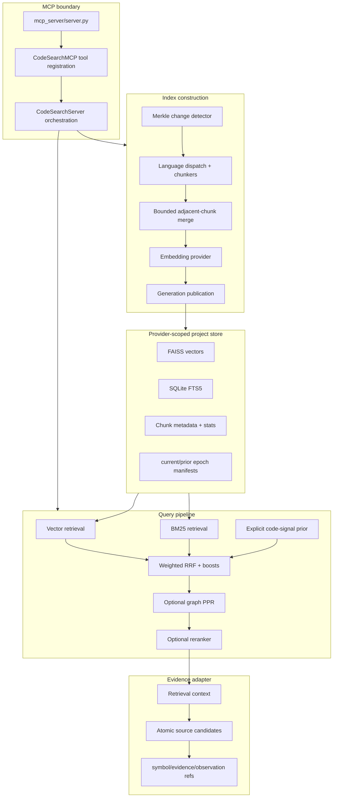

# code-search Architecture and Operating Model

This document describes the runtime architecture of `code-search`, the
contracts that make an index trustworthy, and the boundary between discovery
and proof.

## State of Record

| Dimension | State reviewed 2026-08-13 |
|---|---|
| Implementation baseline | `cbdb9bd` |
| Published release | `v0.3.6` |
| Source/release relationship | Exact: the tag and reviewed implementation commit match |
| Runtime assertion | None; inspect the installed MCP process separately |
| Server surface | 16 MCP tools |
| Registered chunking surface | 17 language modes, 21 file extensions |

The repository contains older experiments and dated findings. They remain
useful evidence but are not automatically statements about the current
runtime. The source modules below and the release tag are the architecture of
record.

## Design Intent

`code-search` optimizes for four properties:

1. **High-recall discovery.** Natural-language and exact code signals share a
   hybrid retrieval path.
2. **Explicit state.** Search results identify the project, source checkout,
   embedding configuration, and published index generation that produced them.
3. **Fail-closed publication.** A partially written or source-incoherent index
   must not become ready.
4. **Selectable evidence.** The backend offers immutable exact source
   coordinates; a model should select evidence rather than invent a range.

It is not an editor, an organization-wide search service, a call graph, or a
taint analyzer.

## Component Model



## Index Construction

### 1. Project and Provider Resolution

`CodeSearchServer` resolves an absolute project path and an effective embedding
configuration. The storage key includes the provider when one is explicit or
persisted, which allows (for example) a Voyage and a local index for the same
checkout to coexist. A verified manifest, rather than ambient environment
variables alone, is authoritative for reading an existing index.

The project root refuse-check runs before project state is materialized. Broad
or sensitive roots such as a home directory are not silently indexed.

### 2. Source Identity Fence

`search/index_identity.py` derives:

- `repository_id` from a normalized remote, with a resolved-path fallback;
- `checkout_id` from the resolved checkout path;
- `source_revision` from Git `HEAD`;
- `dirty_fingerprint` from status, worktree diff, staged diff, and untracked
  content; and
- `index_generation` from the complete identity envelope.

`index_directory` captures identity before work starts and again before a
generation is marked ready. If the checkout changes during the run, the job
fails instead of binding old vectors to a new tree.

### 3. Chunking

`chunking/languages/LANGUAGE_MAP` is the current dispatch contract. It maps 21
extensions to 17 language modes:

`c`, `cpp`, `csharp`, `go`, `hcl`, `java`, `javascript`, `jsx`, `markdown`,
`nix`, `python`, `rust`, `svelte`, `toml`, `tsx`, `typescript`, and `yaml`.

Language-specific chunkers prefer function, class, section, or binding
boundaries. `chunking/chunk_merging.py` then combines small adjacent chunks up
to the configured non-whitespace-character budget so imports, constants, and
other gap code are not systematically lost.

The resulting chunk is a retrieval unit. It may contain more than one atomic
claim-supporting line, which is why chunk coordinates are not treated as
minimal evidence.

### 4. Embeddings and Lexical State

`embeddings/embedder.py` resolves configuration in this order: explicit call,
stored project configuration, process environment, then provider fallback.

- With `VOYAGE_API_KEY`, code mode defaults to `voyage` /
  `voyage-4-large`.
- Without a Voyage key, the provider defaults to the local
  sentence-transformer path.
- `jina` is the larger local code-embedding option.
- `voyage-code-3`, `voyage-context`, and OpenAI remain explicit alternatives.

Contextual headers add path, chunk type, and name before embedding. FAISS owns
vector retrieval; SQLite FTS5 owns lexical retrieval and chunk lookup.
Quantization defaults to trained `int8`.

### 5. Incremental Updates

`search/incremental_indexer.py` compares the current Merkle DAG with the
provider-scoped saved snapshot. It removes deleted or replaced chunk metadata,
embeds changed chunks, and preserves unchanged chunks. Because FAISS deletion
is represented through live metadata rather than immediate physical row
removal, stale-vector ratios are measured. A high ratio escalates an
incremental update to full compaction.

### 6. Atomic Generation Publication

`search/indexer.py` writes a candidate generation, validates vector/chunk
cardinality and SQLite integrity, hashes artifacts, then publishes it. The
generation is immutable after publication.

`search/epoch_manifest.py` manages:

- `manifest/current.json`: active verified epoch;
- `manifest/prior.json`: last verified fallback; and
- `manifest/candidate.json`: transient candidate state.

Compatibility files at the project-store root are mirrors of the published
generation. On APFS, `v0.3.6` prefers copy-on-write clones for those mutable
mirrors; unsupported filesystems use byte copies. A publication marker makes
interrupted mirror replacement recoverable. Readers verify artifact hashes and
can fall back to `prior`; they do not accept a corrupt candidate as current.

## Query Execution

### Search Modes

| Mode | Behavior |
|---|---|
| `keyword` | FTS5 BM25 only; best for exact code tokens and strings |
| `semantic` | Vector retrieval only; best for paraphrases and concepts |
| `hybrid` | Both arms plus fusion; process default |
| `auto` | Hybrid policy with query-shape routing and signal handling |

`search/retrieval.py` owns raw vector/BM25 retrieval and explicit code-signal
promotion. `search/fusion.py` owns weighted RRF and content-type boosts.
`search/pipeline.py` composes optional PPR and reranking. `search/searcher.py`
provides orchestration and compatibility exports.

For ordinary code queries, vector/BM25 weights default to 0.65/0.35. Queries
with source paths, qualified members, acronyms, or other strong code signals
can widen the candidate pool and emphasize exact evidence before fusion loses
score magnitude. The current `v0.3.6` source-role prior and file
diversification are deterministic post-retrieval policies.

### Optional Stages

- **PPR:** `CODE_SEARCH_PPR_ENABLED` is false by default. When enabled, PPR
  reads a compatible graph sidecar and reports whether it applied.
- **Reranking:** `RERANKER=auto` is the default: Sonnet when `ANTHROPIC_API_KEY` is set, otherwise off. The result metadata
  distinguishes success, disabled state, missing key, timeout, rate limit, and
  fallback. A reranker exception does not discard the hybrid results.
- **Query expansion:** BM25 synonym expansion is enabled by default under the
  packaged `generic` profile; `CODE_SYNONYMS_PATH` overlays deployment terms.

### Result Metadata

Every normal response carries enough operational state to diagnose silent
degradation:

- reranker and PPR outcome;
- source freshness (`fresh`, refreshed, stale-disabled, in-progress, or
  failed-last-good);
- manifest status (`fresh`, `stale_using_prior_epoch`, `missing`, or
  `corrupt`);
- provider/model/dimension identity; and
- stale-vector advisory when the threshold is crossed.

Observability failure is advisory and must not break an otherwise valid
result, but a missing or stale source/index identity prevents evidence
attestation.

## Evidence Contract

`search/evidence.py` defines canonical SHA-256-derived IDs for:

| Type | Meaning |
|---|---|
| `symbol_ref` | One canonical symbol at one source revision |
| `evidence_ref` | One path/range/type in one index generation |
| `observation_ref` | One engine's stance and derivation over evidence |
| `claim_ref` | Stable repository-scoped claim identity |

`mcp_server/evidence_tools.py` is additive: it calls the same
`CodeSearchServer.search_code` path, captures the indexed full chunk inside two
identity snapshots, and attaches exact nonblank-line candidates.

The contract deliberately separates two roles:

```text
retrieval_context  = broad unit useful for reading and discovery
atomic_source_line = selectable claim evidence issued by the backend
```

An evidence ID binds repository, revision, generation, relative path, exact
line, evidence type, and optional canonical symbol. Identical canonical input
produces the same ID in the Python search implementation and the Go graph
implementation. If metadata, coordinates, source bytes, or generation cannot
be reconciled, the adapter emits no evidence candidates.

## Project Isolation and Cross-Project Discovery

Each project/provider pair has its own index, manifest, Merkle snapshot, and
configuration. `switch_project` changes active in-memory state but does not
rewrite an index.

`search_all_projects` opens selected indexes independently, retains each
project's identity, ranks within that index, and interleaves results in a
project-balanced order. It never interprets a raw score from project A as
comparable with project B. The operation is a discovery boundary: select the
project, then run `search_code_evidence` against that exact project before
making a claim.

There is no unified organization index, ACL layer, index-to-index scoring
calibration, or continuously managed indexing fleet.

## Failure Semantics

| Failure | Behavior |
|---|---|
| Source changes during indexing | Job fails; candidate is not ready |
| Candidate artifact mismatch | Publication is refused |
| Current manifest corrupt | Reader attempts verified prior generation |
| Current and prior corrupt | Status is `corrupt`; do not claim freshness |
| Reranker unavailable | Preserve hybrid order; report fallback reason |
| Evidence identity stale or changes mid-query | Return retrieval, emit no evidence refs |
| Concurrent writer conflict | Serialize through process/interprocess locks |
| Cross-project job collision | Report the bound job/project/provider conflict |

## External Trust Boundaries

- Voyage and OpenAI embeddings transmit source-derived chunk text.
- Sonnet reranking transmits the query and candidate content.
- Local/Jina embeddings plus `RERANKER=off` keep the query pipeline local after
  model download.
- Raw query logging is off by default. Metadata-only history excludes query
  text; `full` history is an explicit opt-in.
- Destructive MCP tools delete local indexes only; they do not delete source
  repositories.

## Composition with code-graph

The two servers do not silently call each other.

```text
code-search discovery
  -> project-bound atomic source evidence
  -> code-graph symbol/relationship query when structure is required
  -> source read or stronger analyzer for unresolved assurance
```

Use search for concepts because graph-only conceptual localization remains the
weaker operating point. Use graph for callers, callees, inheritance,
implementation, impact, and evidence about an edge. Use CodeQL when the claim
requires variable-level source-to-sink semantics.

## Source Map

| Concern | Primary source |
|---|---|
| MCP registration and annotations | `mcp_server/code_search_mcp.py` |
| Server orchestration and project state | `mcp_server/code_search_server.py` |
| Tool descriptions | `mcp_server/strings.yaml` |
| Chunker registry | `chunking/languages/__init__.py` |
| Embedding configuration | `embeddings/embedder.py` |
| Search configuration | `search/config.py` |
| Retrieval and signal prior | `search/retrieval.py` |
| Fusion | `search/fusion.py` |
| Optional-stage composition | `search/pipeline.py` |
| Storage and generation publication | `search/indexer.py` |
| Manifest fallback | `search/epoch_manifest.py` |
| Index identity | `search/index_identity.py` |
| Incremental indexing | `search/incremental_indexer.py` |
| Evidence schema | `search/evidence.py` |
| Evidence adapter | `mcp_server/evidence_tools.py` |

## Known Boundaries

- The public comparison is a bounded file-localization endpoint, not proof of
  general search-platform superiority.
- Very-large-repository operation is demonstrated on one host; the current
  index footprint and warm-query latency are not class-leading.
- The server has no editor-native UX, repository history language,
  organization ACL model, review loop, or distributed fleet.
- Search evidence proves an exact source observation at an exact generation.
  It does not by itself prove behavior, reachability, uniqueness, or absence.
